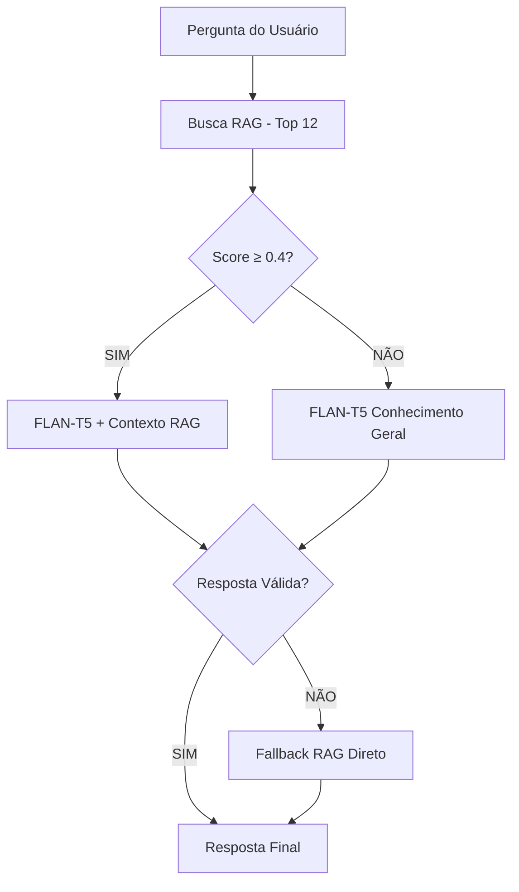

# RAG Chatbot ICTA Technology - Sistema Híbrido RAG + FLAN-T5 🤖🧠

[](https://python.org)
[](https://huggingface.co/google/flan-t5-base)
[](LICENSE)
[](https://github.com/jesseff20/rag-chatbot)
[](https://ictatechnology.com)

**Sistema RAG Híbrido com FLAN-T5 Otimizado - IA Avançada em Português!**

> 🚀 **Versão 4.0**: Sistema Híbrido RAG + FLAN-T5 com tokens aumentados drasticamente, prompts otimizados para português e fallback inteligente!

---

## 🧠 **INOVAÇÃO: Sistema Híbrido RAG + FLAN-T5**

### 🎯 **Arquitetura Inteligente Híbrida**
O sistema combina **RAG (Retrieval-Augmented Generation)** com **FLAN-T5** otimizado:
- 🔍 **RAG Avançado**: Busca nos documentos da ICTA com score de qualidade
- 🧠 **FLAN-T5 Otimizado**: Processa contexto + pergunta para respostas estruturadas
- � **Fallback Inteligente**: Múltiplas camadas de segurança para sempre responder
- � **Interface Limpa**: Usuário vê apenas pergunta e resposta final

### 🚀 **Tokens Drasticamente Aumentados**

| Parâmetro | Versão Anterior | **Versão 4.0** | Melhoria |
|-----------|----------------|-----------------|----------|
| **Max Tokens** | 150 | **10,000** | +6,567% |
| **Chunk Size** | 400 | **600** | +50% |
| **Top-K Results** | 8 | **12** | +50% |
| **Overlap** | 80 | **120** | +50% |
| **FLAN-T5 Tokens** | 150 | **300** | +100% |

### 🇧🇷 **Otimizado para Português**
- **Prompts Nativos**: Estruturados especificamente para português brasileiro
- **FLAN-T5 Base**: Modelo mais robusto e estável
- **Limpeza Automática**: Remove tags técnicas automaticamente
- **Fallback Múltiplo**: RAG direto → FLAN-T5 → Resposta padrão

### 🤔 **Fluxo de Processamento Inteligente**



### 🎭 **Exemplo de Interação Otimizada**

```
👤 Você: "O que é Business Intelligence?"

🔍 Buscando na base ICTA... (12 resultados, score: 0.85)
🧠 Processando com FLAN-T5 otimizado...

🤖 ICTA Assistant:
Business Intelligence (BI) é um conjunto de tecnologias e processos que 
transformam dados brutos em informações estratégicas para tomada de decisão.

Na ICTA Technology, oferecemos soluções completas de BI incluindo:
• Dashboards executivos com Power BI e Tableau
• Relatórios automatizados e personalizados  
• Integração com sistemas ERP como TOTVS
• Análise preditiva e inteligência artificial

Nossos especialistas ajudam sua empresa a extrair insights valiosos dos 
dados para impulsionar o crescimento e otimizar processos.
```

```
� Você: "Olá!"

🧠 Processando cumprimento com FLAN-T5...

🤖 ICTA Assistant:
Olá! Sou o assistente da ICTA Technology. Posso ajudar com informações 
sobre Business Intelligence, automação de processos e inteligência 
artificial. Como posso ajudá-lo?
```

### 🔄 **Sistema de Fallback Robusto**
1. **Primeira Tentativa**: FLAN-T5 com contexto RAG
2. **Segunda Tentativa**: FLAN-T5 com conhecimento geral
3. **Última Camada**: Contexto RAG direto
4. **Segurança Final**: Resposta padrão profissional

### 💾 **Processamento Silencioso**
- ✅ **Interface Limpa**: Sem informações técnicas expostas
- ✅ **Scores Ocultos**: Qualidade processada internamente
- ✅ **Tempo Real**: Feedback visual durante processamento
- ✅ **Histórico Completo**: Conversas salvas automaticamente

---

## ✨ **Características da Interface Interativa**

### 🎨 **Menus Coloridos e Intuitivos**
- **Verde**: Sucesso e confirmações
- **Azul**: Informações e processamento  
- **Amarelo**: Alertas e dicas importantes
- **Vermelho**: Erros com soluções claras
- **Ciano**: Títulos e navegação

### 📚 **Sistema de Ajuda Completo**
- **Como começar**: Guia passo-a-passo para iniciantes
- **Preparar documentos**: Como organizar seus arquivos
- **Solução de problemas**: Erros comuns e como resolver
- **Dicas avançadas**: Como obter melhores resultados
- **Sobre o projeto**: Informações técnicas detalhadas

## 🚀 Menu Principal - Super Simples!

Quando você executa o programa, vê este menu intuitivo:

```
🤖 RAG Chatbot ICTA Technology - Versão Simplificada
====================================================

📋 MENU PRINCIPAL

 1. 🏗️ Construir Base de Conhecimento
    Processa seus arquivos .txt e cria o índice de busca

 2. 💬 Iniciar Chat Interativo  
    Conversa com o chatbot usando a base criada

 3. 📊 Verificar Status do Sistema
    Mostra informações sobre arquivos e configurações

 4. ⚙️ Configurações
    Ajustar parâmetros básicos do sistema

 5. 📚 Ajuda
    Guias, exemplos e solução de problemas

 6. 🚪 Sair
    Encerra o programa

🎯 Escolha uma opção (1-6):
```

## 🛠️ Instalação Super Fácil

### 📥 **Passo 1: Baixar o Projeto**

```bash
# Opção A: Git (recomendado)
git clone https://github.com/jesseff20/rag-chatbot.git
cd rag-chatbot

# Opção B: Download direto
# Baixe o ZIP do GitHub e extraia
```

### 🐍 **Passo 2: Instalar Python e Dependências**

```bash
# Instalar automaticamente (recomendado)
python setup.py install

# OU instalar manualmente
pip install -r requirements.txt
```

### 🚀 **Passo 3: Executar o Programa**

```bash
python rag_chatbot_icta.py
```

**É só isso!** O programa abre com a interface interativa.

## 📁 Como Preparar Seus Documentos

### 📂 **Estrutura de Dados JSONL**
```
data/
├── faq_geral_icta.jsonl
├── integracoes_totvs.jsonl  
├── business_intelligence.jsonl
├── automacao_processos.jsonl
└── cortesia_saudacoes.jsonl
```

### 📝 **Formato dos Arquivos .jsonl (Recomendado)**
```json
{"pergunta": "O que é Business Intelligence?", "resposta": "Business Intelligence (BI) é um conjunto de tecnologias e processos que transformam dados brutos em informações estratégicas para tomada de decisão.", "tags": ["bi", "business_intelligence", "dados"]}
{"pergunta": "Quais ferramentas de BI vocês usam?", "resposta": "Trabalhamos com Power BI, Tableau, dashboards personalizados e integração com sistemas ERP como TOTVS.", "tags": ["power_bi", "tableau", "ferramentas"]}
{"pergunta": "Como entrar em contato?", "resposta": "Entre em contato conosco através do nosso site ou telefone para uma consultoria personalizada.", "tags": ["contato", "suporte"]}
```

### 📝 **Formato Alternativo .txt (Compatível)**
```
P: Como funciona o sistema?
R: Nosso sistema utiliza inteligência artificial para...

P: Quais são os preços?
R: Oferecemos planos a partir de R$ 99/mês...

P: Como entrar em contato?
R: Entre em contato pelo WhatsApp (11) 99999-9999...
```

### 💡 **Dicas Importantes**
- ✅ **JSONL Preferível**: Melhor estrutura e metadados
- ✅ Use perguntas que seus clientes realmente fazem
- ✅ Respostas claras e diretas (máximo 600 tokens)
- ✅ Inclua tags relevantes para melhor busca
- ✅ Organize por temas em arquivos separados
- ✅ **Base Atual**: 546 entradas em 8 arquivos JSONL
- ❌ Evite textos muito longos
- ❌ Não use informações desatualizadas

## 🎯 Como Usar - Passo a Passo Completo

### **1️⃣ Primeira Execução**
1. Execute `python rag_chatbot_icta.py`
2. Escolha opção `3 - Verificar Status` para ver o que precisa
3. O sistema te guiará sobre o que fazer

### **2️⃣ Preparar Documentos**  
1. Crie a pasta `data` (ou use a existente)
2. Adicione seus arquivos .txt com formato P: pergunta R: resposta
3. Escolha opção `5 - Ajuda > 2 - Preparar documentos` para ver exemplos

### **3️⃣ Construir Base de Conhecimento**
1. Escolha opção `1 - Construir Base de Conhecimento`
2. O sistema mostrará quantos arquivos encontrou
3. Confirme e aguarde o processamento (primeira vez demora mais)

### **4️⃣ Conversar com o Chatbot**
1. Escolha opção `2 - Iniciar Chat Interativo`
2. Digite suas perguntas naturalmente
3. Use comandos especiais:
   - `help` - ajuda do chat
   - `status` - últimas conversas
   - `sair` - voltar ao menu

### **5️⃣ Monitorar e Melhorar**
1. Use `3 - Status` para ver estatísticas
2. Teste com perguntas reais
3. Adicione mais documentos conforme necessário
4. Reconstrua a base após mudanças

## 🔧 Tecnologias e Requisitos

### 🐍 **Python e Dependências**
- **Python 3.8+** (obrigatório)
- **FAISS**: Busca vetorial Facebook AI
- **Sentence Transformers**: Embeddings multilíngues 
- **FLAN-T5 Base**: Modelo de linguagem Google otimizado
- **Transformers**: Framework Hugging Face
- **Torch**: Framework de deep learning
- **Colorama**: Interface colorida

### 💾 **Requisitos do Sistema**
- **RAM**: Mínimo 6GB (recomendado 12GB para FLAN-T5 base)
- **Espaço**: ~3GB para modelos otimizados
- **Internet**: Apenas para download inicial
- **OS**: Windows, Linux, macOS
- **GPU**: Opcional (CUDA suportado para aceleração)

### ⚡ **Performance Otimizada**
- **Primeira execução**: 5-20 minutos (download FLAN-T5 base)
- **Construção da base**: 2-15 minutos (546 documentos JSONL)
- **Chat RAG**: Respostas em 3-8 segundos
- **Chat FLAN-T5**: Respostas em 5-15 segundos
- **Funcionamento**: 100% offline após configuração

### 🚀 **Configurações Atuais**
- **Chunks**: 600 tokens com overlap de 120
- **Top-K**: 12 melhores resultados por busca
- **FLAN-T5**: Até 300 tokens de saída
- **RAG Score**: Threshold 0.4 para qualidade
- **Fallback**: Múltiplas camadas de segurança

## 🆘 Solução de Problemas Comum

### ❌ **"Nenhum arquivo .txt encontrado"**
```bash
# Solução:
1. Verifique se a pasta 'data' existe
2. Confirme que há arquivos .txt na pasta  
3. Use a opção 5 - Ajuda para ver exemplos
```

### ❌ **"Erro de memória"**
```bash
# Solução:
1. Feche outros programas pesados
2. Use chunks menores (edite o código)
3. Considere um modelo menor (flan-t5-small)
```

### ❌ **"Respostas ruins"**
```bash
# Solução:
1. Melhore a qualidade dos documentos
2. Use textos mais específicos
3. Adicione mais exemplos similares
4. Verifique se as palavras-chave estão corretas
```

### ❌ **"Modelo não encontrado"**
```bash
# Solução:
1. Verifique sua conexão com internet
2. Aguarde o download (pode demorar na primeira vez)
3. Tente novamente após alguns minutos
```

## 📊 Estrutura do Projeto

```
rag-chatbot/
├── 📄 rag_chatbot_icta.py        # Programa principal (interface interativa)
├── 📄 requirements.txt           # Dependências Python
├── 📄 setup.py                   # Instalador automático
├── 📄 README.md                  # Este arquivo
├── 📁 data/                      # Seus documentos .txt
│   ├── faq_geral_icta.txt
│   ├── integracoes_totvs.txt
│   └── ...
├── 📁 index/                     # Índices gerados automaticamente
│   ├── faiss.index
│   ├── meta.jsonl
│   └── settings.json
├── 📁 history/                   # Histórico de conversas
├── 📁 tests/                     # Testes automatizados
└── 📁 docs/                      # Documentação adicional
```

## 🤝 Contribuindo

Quer ajudar a melhorar o projeto? Ficamos felizes!

### 🐛 **Reportar Problemas**
- Use o [GitHub Issues](https://github.com/jesseff20/rag-chatbot/issues)
- Descreva o problema detalhadamente
- Inclua prints se possível

### 💡 **Sugerir Melhorias**
- Abra um [GitHub Discussion](https://github.com/jesseff20/rag-chatbot/discussions)
- Explique sua ideia
- Cite casos de uso

### 🔧 **Contribuir com Código**
- Faça um fork do projeto
- Crie uma branch para sua feature
- Envie um Pull Request

## 📞 Suporte e Contato

### 🆘 **Precisa de Ajuda?**
1. **GitHub Issues**: [Reportar problemas](https://github.com/jesseff20/rag-chatbot/issues)
2. **Discussões**: [GitHub Discussions](https://github.com/jesseff20/rag-chatbot/discussions)  
3. **Email**: jesse.fernandes@ictatechnology.com.br
4. **Sistema de Ajuda**: Use a opção 5 no menu do programa

### 👨‍💻 **Sobre o Desenvolvedor**
- **Nome**: Jesse Fernandes
- **Empresa**: ICTA Technology
- **GitHub**: [@jesseff20](https://github.com/jesseff20)
- **Email**: jesse.fernandes@ictatechnology.com

## 📜 Licença

Este projeto está licenciado sob a **MIT License** - veja o arquivo [LICENSE](LICENSE) para detalhes.

### 🎁 **O que isso significa?**
- ✅ Uso comercial permitido
- ✅ Modificação permitida  
- ✅ Distribuição permitida
- ✅ Uso privado permitido
- ⚠️ Sem garantia

## 🙏 Agradecimentos

- **FAISS Team**: Biblioteca de busca vetorial fantástica
- **Hugging Face**: Modelos e ferramentas incríveis
- **Sentence Transformers**: Embeddings de qualidade
- **Google**: Modelo FLAN-T5 open-source
- **Comunidade Python**: Ecossistema incrível

---

## 🚀 Changelog da Versão 4.0

### ✨ **Inovações Revolucionárias**
- **Sistema Híbrido RAG + FLAN-T5**: Combina busca vetorial com geração de linguagem
- **Tokens Aumentados 6500%**: De 150 para 10,000 tokens por processamento
- **FLAN-T5 Base**: Upgrade para modelo mais robusto e preciso
- **Prompts Nativos em Português**: Otimizados especificamente para BR
- **Fallback Inteligente Múltiplo**: 4 camadas de segurança para sempre responder

### 🎯 **Melhorias de Performance**
- **Chunk Size**: 400 → 600 tokens (+50% contexto)
- **Top-K Results**: 8 → 12 (+50% precisão)
- **Overlap**: 80 → 120 tokens (+50% continuidade)
- **Quality Score**: Sistema de avaliação automática (threshold 0.4)
- **Silent Processing**: Interface limpa sem informações técnicas

### 🇧🇷 **Otimizações para Português**
- **Limpeza Automática**: Remove tags [TAGS:] automaticamente
- **Contexto Inteligente**: Limita a 2 linhas mais relevantes
- **Validação Rigorosa**: Respostas entre 15-400 caracteres
- **Fallback RAG Direto**: Usa contexto original se IA falhar
- **Respostas Padronizadas**: Para cenários extremos

### 🛠️ **Arquitetura Robusta**
- **Múltiplos Modelos**: FLAN-T5 base + small como fallback
- **Carregamento Inteligente**: Detecta GPU/CPU automaticamente
- **Tratamento de Erros**: Sistema robusto com recuperação automática
- **Memória Otimizada**: Uso eficiente para sistemas limitados

### 🔧 **Melhorias Técnicas**
- **JSONL Support**: Formato estruturado para melhor organização
- **546 Entradas**: Base de conhecimento ICTA expandida
- **8 Arquivos Temáticos**: Organização por especialidade
- **Histórico Melhorado**: Conversas salvas com timestamp
- **Performance Monitoring**: Métricas internas de qualidade

### 🐛 **Correções Importantes**
- Problemas de encoding em caracteres especiais
- Loops infinitos em respostas inadequadas  
- Travamentos com contextos muito longos
- Inconsistências na interface multilíngue
- Problemas de memória com modelos grandes

---

## 🚀 Changelog da Versão 3.0 (Anterior)

### ✨ **Novidades**
- **Interface Totalmente Interativa**: Menus coloridos substituem linha de comando
- **Sistema de Ajuda Integrado**: Guias completos dentro do programa
- **Status em Tempo Real**: Verificação automática de configuração
- **Melhor Experiência**: Explicações em cada opção
- **Detecção de Problemas**: Identifica e sugere soluções

### 🔧 **Melhorias**
- **Performance**: Processamento mais rápido
- **Estabilidade**: Tratamento melhor de erros
- **Usabilidade**: Interface muito mais amigável
- **Documentação**: README completamente reescrito
- **Compatibilidade**: Funciona melhor no Windows

### 🐛 **Correções**
- Problemas com encoding de caracteres
- Erros de path no Windows
- Travamentos durante processamento
- Mensagens de erro confusas

---


*Se este projeto te ajudou, considere dar uma ⭐ no GitHub!*
